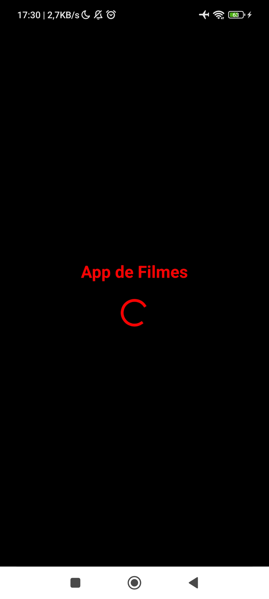
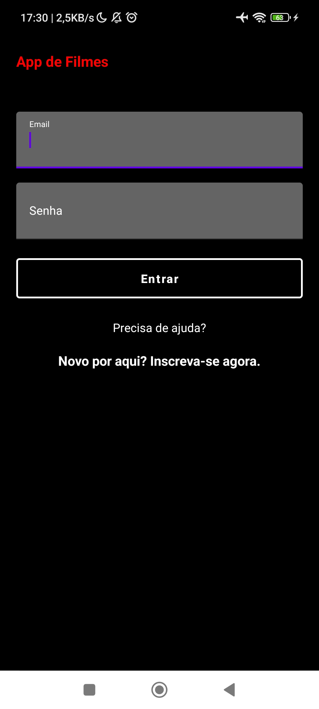
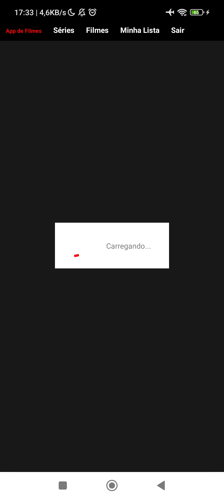
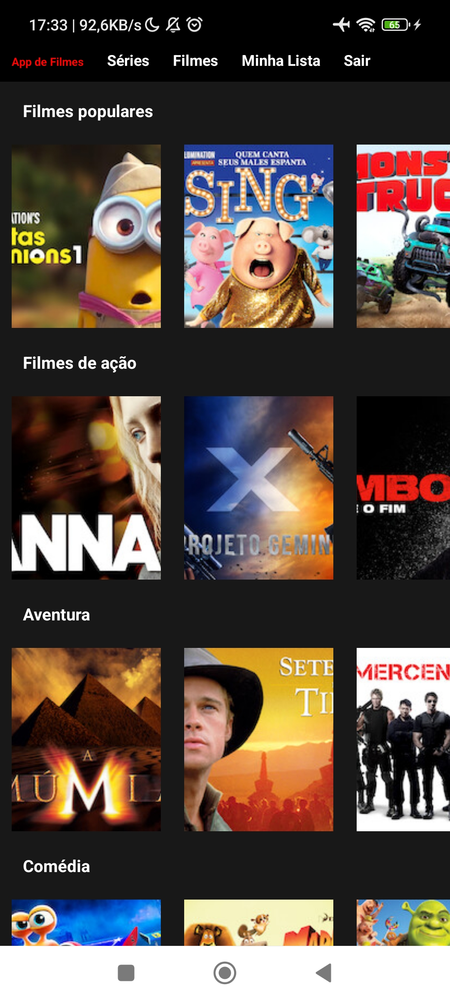
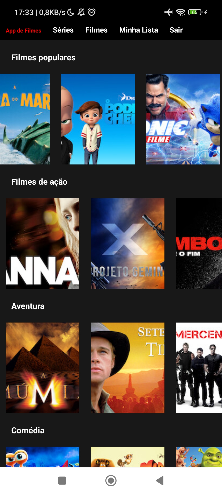
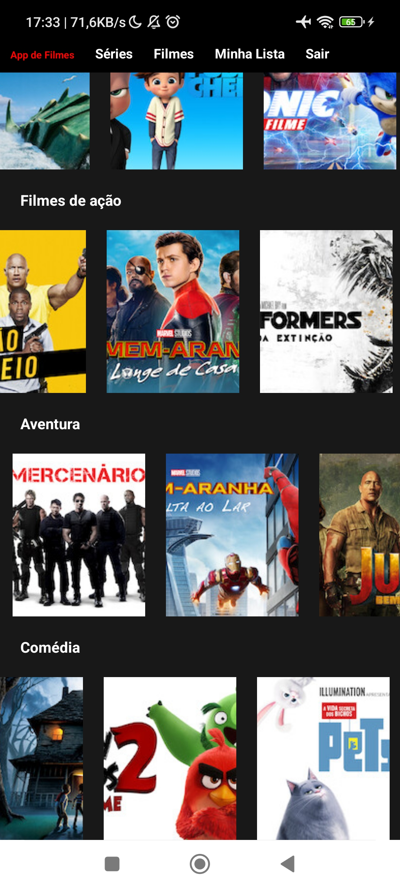
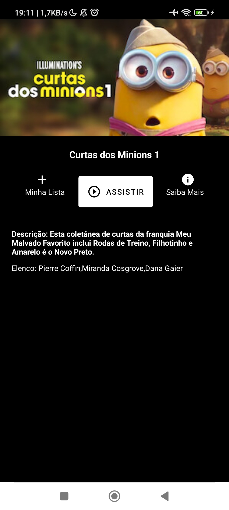
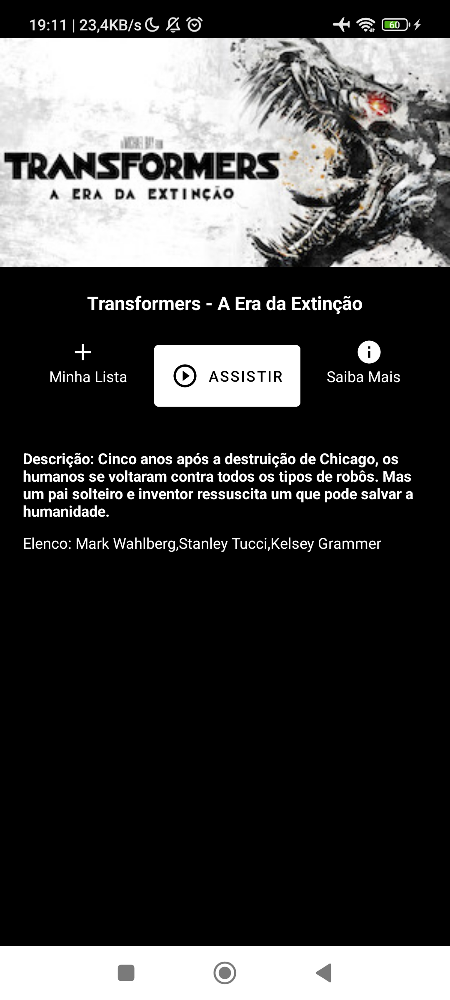

# App de Filmes - NetflixClone 🎥🍿

Este é um projeto de um aplicativo para visualização de filmes, criado utilizando Kotlin e integrado com o Firebase para autenticação de usuários e armazenamento de dados. O objetivo deste projeto é fornecer uma experiência semelhante à do Netflix, permitindo aos usuários ver informações sobre filmes.

    
    
    
    
    
    
    
    
    

##

## Funcionalidades 🧰

### Criando novas cores 🎨

Para criar novas cores no aplicativo, foi utilizado o arquivo `colors.xml`, onde é possível definir novas cores utilizando o formato hexadecimal.

### Manipulando a barra de ação e a Barra de Status 🌟

Foi utilizada a biblioteca `androidx.appcompat.widget.Toolbar` para criar a barra de ação customizada. Já a manipulação da Barra de Status foi realizada através do arquivo `styles.xml`.

### ProgressBar ⏳

A ProgressBar é uma barra de progresso que indica o progresso de uma tarefa. Foi utilizada na tela de carregamento do aplicativo.

### Efeitos de Transição 🎬

Foram utilizados efeitos de transição entre as telas do aplicativo para uma melhor experiência do usuário.

### EditText utilizado TextInputEditText e TextInputLayout – Permite uma configuração maior do edit text ✏️

O EditText utilizado foi o `TextInputEditText`, que permite uma configuração maior, como por exemplo, a exibição de um hint flutuante com a biblioteca `com.google.android.material.textfield.TextInputLayout`.

### Alterando as propriedades do cursor – textCursorDrawable ✏️

As propriedades do cursor foram alteradas para uma melhor adequação ao design do aplicativo.

### Personalização de Button pelo próprio xml 🎨

Os botões do aplicativo foram personalizados diretamente no arquivo XML para melhor adequação ao design.

### ScrollView 📜

A ScrollView foi utilizada para possibilitar a rolagem da tela em casos de conteúdo extenso.

### Inicialização com cursor já em um EditText – requestFocus() ✏️

Foi utilizado o método `requestFocus()` para inicializar o cursor já em um EditText.

### Utilização de helperText para erro na entrada de dados 🚫

Foi utilizado o helperText para exibir mensagens de erro na entrada de dados do usuário.

### “Escondendo” elementos do layout setando sua visibilidade como “gone” 🙈

Elementos do layout foram escondidos através do método `setVisibility(View.GONE)`.

### Configurando o Firebase no Android Studio 🔥

O Firebase foi configurado no Android Studio para possibilitar o armazenamento de dados do aplicativo.

### Cadastro de Usuários no Firebase 🧑‍🤝‍🧑

Foi implementada a funcionalidade de cadastro de usuários no Firebase para garantir a segurança das informações dos usuários.

### Cadastro - Tratando as Exceptions ❌

Exceptions foram tratadas na tela de cadastro para garantir a melhor experiência do usuário.

### FirebaseAuth – Autenticando Usuários 🔒

A autenticação de usuários foi realizada através do FirebaseAuth, possibilitando o acesso à área restrita do aplicativo.

### Verificação de usuários logados 🕵️‍♂️

Foi implementada a verificação de usuários logados para fazer login automatico no caso positivo.

### Criação de header principal 🎬

Foi criado um header principal no aplicativo para melhorar a experiência do usuário.

### Deslogando usuário 🔓

Foi implementada a funcionalidade de logout para possibilitar que o usuário saia do aplicativo.

### Construção de uma lista de vertical com Categorias 📜
Foi construída uma lista vertical de categorias para organizar os filmes disponíveis no app.

### Construção de lista horizontal de filmes dentro de cada Categoria 🎞️
Dentro de cada categoria, foi criada uma lista horizontal de filmes para que o usuário possa navegar de forma intuitiva.

### Criação do Adapter 🛠️
Foi criado um Adapter personalizado para a lista de filmes e para a lista de categorias.

### Criação do item de lista - Lista de Categorias 🎥📊
Foi criado um layout personalizado para cada item da lista de categorias.

### Validação da lista vertical de categorias ✅
Foi feita uma validação para garantir que a lista de categorias seja carregada corretamente.

### Configuração da lista horizontal com Filmes ⚙️🎬
Foi realizada a configuração da lista horizontal de filmes para que os filmes sejam exibidos corretamente.

### Validação da lista de filmes com dados fakes ✅
Foi feita uma validação para garantir que a lista de filmes seja carregada corretamente com dados falsos.

### Consumindo os dados da API de Filmes 🌐🎥
Foi feita a integração com uma API de filmes para consumir os dados reais de filmes.

### Configurando o Retrofit ⚙️🔗
Foi configurado o Retrofit para realizar as requisições HTTP necessárias para obter os dados da API.

### Configurando e utilizando o Glide para baixar e renderizar imagens vindas de urls 🌐🖼️
Foi configurado o Glide para baixar e renderizar as imagens dos filmes vindas de URLs.

### Definindo eventos de click no recyclerView da lista de filmes através do próprio Adapter 🎬🖱️
Foram definidos eventos de click no recyclerView da lista de filmes através do próprio Adapter para que o usuário possa interagir com os filmes.

### Criação do layout de detalhes do filme 🎬📝
Foi criado um layout personalizado para exibir os detalhes de cada filme selecionado pelo usuário.

### Bloqueando a rotação da tela em algum layout 🚫🔄
Foi bloqueada a rotação da tela em determinado layout para evitar problemas de usabilidade.

### Passando dados entre telas com o putExtra (Intent) 📩📤
Foi utilizado o putExtra (Intent) para passar dados entre as telas do app.
